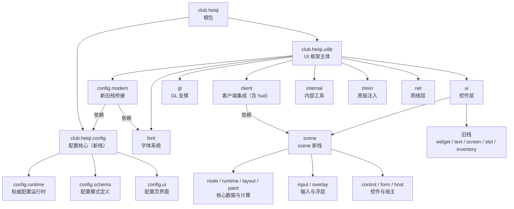

# L0 框架总览：club.heiqi 包树地图

一句话定位：全仓一级包树与子系统关系，标注 scene 新栈与旧栈并存及 scene core 依赖边界。

> 素材基线：源码实时状态（2026-08-13）。涉及类名可在 `src/main/java` 核对。

## 包树与子系统关系

## 关键边界（真值锚点）

- scene 新栈与旧栈（`widget` / `text` / `screen` / `slot` / `inventory`）并存，互不替代；新增界面默认走新栈。
- scene core（`node` / `runtime` / `layout` / `paint` / `input` / `overlay`）禁止依赖旧栈包，也禁止依赖 MC / GL 类型；平台认知只经 `ui.scene` 顶层 `UiSurface` 与 `ui.render.UiRenderBackend` 抽象进入。
- 配置新栈在 `club.heiqi.config`（core 层），`club.heiqi.uilib.config.modern` 只做桥接，不反向依赖 core。
- 网络层业务门面是 `club.heiqi.uilib.net.api.NetService`，与 UI 无依赖环。
