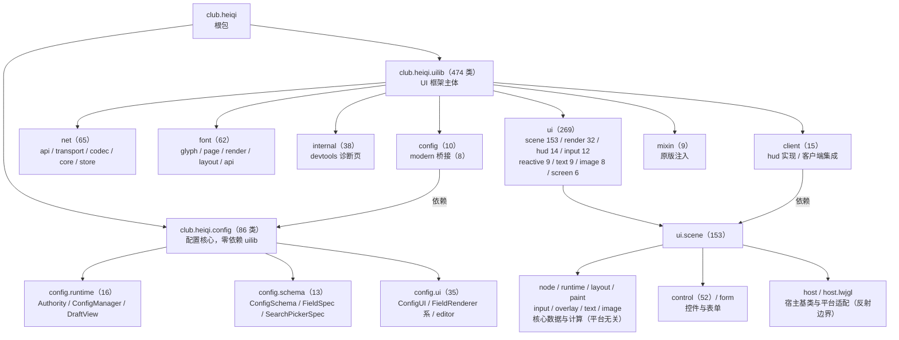

# L0 框架总览：club.heiqi 包树地图

一句话定位：全仓一级包树与子系统关系，标注 scene 核心的平台无关边界与 breaking major 后的旧栈现状。

> 素材基线：源码实时状态（2026-08-18）。涉及类名可在 `src/main/java` 核对。

## 包树与子系统关系

## 关键边界（真值锚点）

- **scene core 平台无关（编译期硬约束）**：`node / runtime / layout / paint / input / overlay / text / image` 编译期零 `org.lwjgl` / `net.minecraft` import；平台适配只存在于 `ui.scene.host.lwjgl`，经 `Class.forName("org.lwjgl(x).input.*")` 反射探测并运行期降级。渲染面抽象是 `ui.scene.UiSurface` 与 `ui.render.UiRenderBackend`。
- **旧栈现状（breaking major 后）**：旧 document 栈（`ui.dom / style / remote / animation / document / paint / layout / page`）已整体删除；`Widget` 树仅作宿主壳（`ViewportWidget`、`AbstractSceneHostWidget` 两个使用点）；`ui.text / ui.screen / ui.render / ui.input` 是现行服务层（文本测量、屏幕桥、渲染后端、输入服务），不是待淘汰旧栈。
- **配置**：`club.heiqi.config` 是核心层（零依赖 uilib）；`club.heiqi.uilib.config.modern` 只做桥接（其 MC 依赖是本职，`ModernConfigScreen extends McScreenBridge`），不反向依赖 core。
- **网络**：业务门面是 `club.heiqi.uilib.net.api.NetService`，与 UI 无依赖环。
- **坐标**：内部全程 logical px 闭环（layout / paint / replay / 裁剪 / 输入共享同一坐标事实）；GUI Scale 只在 host 边界成对转换。
