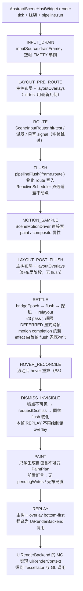
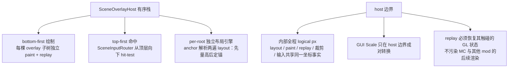

# L1 scene 渲染管线：一帧真实数据流

一句话定位：从宿主 `AbstractSceneHostWidget.render` 经帧管线 `SceneFramePipeline` 到 GL 的一帧完整流水线，阶段顺序与源码一致。

> 素材基线：源码实时状态（2026-08-18）。涉及类名可在 `src/main/java` 核对。
> 帧管线的协议细节（settle 状态机、flush 单点、断言护栏）见 [10-帧管线时序与调度.md](10-帧管线时序与调度.md)。

## 一帧数据流（11 个命名阶段）

宿主 `render` 只做三件事：tick 帧率探针、组装入参、委托 `pipeline.run(...)`；一帧时序协议全部在
`SceneFramePipeline` 内按 `FramePhase` 顺序执行：

## overlay 栈与 host 边界

## 图注（真值锚点）

- 顺序即契约：`SceneFramePipelineTest` 以 trace 固化 11 阶段序列；先 route（只写 signal，不标脏）后 flush。
- flush 只经管线单点 `pipelineFlush(label)`，本帧三处：FLUSH（route）、SETTLE（每轮）、DISMISS（同帧）；
  审计标签（`frame.route` / `frame.settle-pass-N` / `frame.dismiss`）联动 TransactionLog。
- settle 是「signal 层与 layout 层」的跨层反馈环：observer 订阅 `layoutDoneSignal` 读 LayoutBox 写节点 →
  打脏 → 再 layout → 再 bridge；`MAX_LAYOUT_OBSERVER_SETTLE_PASSES = 3`，超限以 DEFERRED 标志显式跨帧
  （不再依赖脏标记隐式延续）。motion completion 的物化由 settle 首轮 flush 兜底。
- paint 阶段只读 signal 与树结构，绝不写 signal；`PaintPlan` 是数据层与渲染层之间唯一的合同交付物。
- replay 永远在主线程执行，消费 `PaintPlan` 与 `UiRenderBackend`；同一 plan 可延迟重放。
- overlay 与主树契约同构（per-tree 隔离），绘制顺序 bottom-first，命中顺序 top-first。
- host 边界转换：内部 logical px 闭环不允许混入 Minecraft GUI Scale；GUI Scale 只在 host 边界成对缩放。
