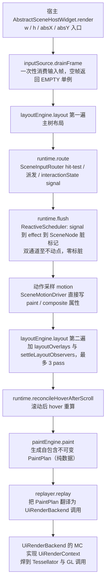
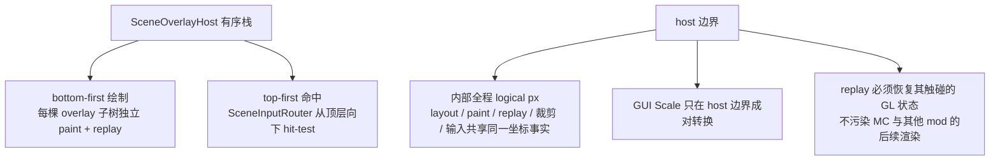

# L1 scene 渲染管线：一帧真实数据流

一句话定位：从宿主 `AbstractSceneHostWidget.render` 到 GL 的一帧完整流水线，顺序与源码一致。

> 素材基线：源码实时状态（2026-08-13）。涉及类名可在 `src/main/java` 核对。

## 一帧数据流（主树）

## overlay 栈与 host 边界

## 图注（真值锚点）

- 顺序不可调换：先 route（只写 signal，不标脏），后 flush（物化全部 signal 与 effect）；Motion 采样在 flush 之后。
- paint 阶段只读 signal 与树结构，绝不写 signal；`PaintPlan` 是数据层与渲染层之间唯一的合同交付物，不持有上游可变状态引用。
- replay 永远在主线程执行，消费 `PaintPlan` 与 `UiRenderBackend`，不触碰 scene 上游可变状态；同一 plan 可延迟重放。
- overlay 与主树契约同构（per-tree 隔离），绘制顺序 bottom-first，命中顺序 top-first。
- host 边界转换：内部 logical px 闭环不允许混入 Minecraft GUI Scale；GUI Scale 只在 host 边界成对缩放。
