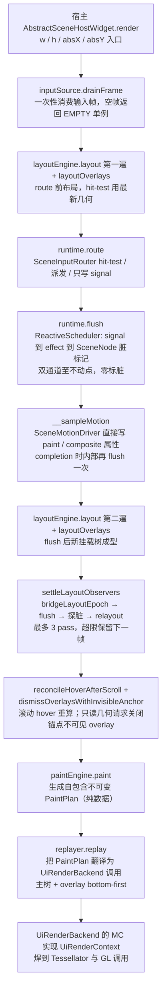
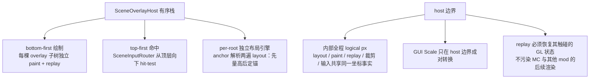

# L1 scene 渲染管线：一帧真实数据流

一句话定位：从宿主 `AbstractSceneHostWidget.render` 到 GL 的一帧完整流水线，顺序与源码一致。

> 素材基线：源码实时状态（2026-08-18）。涉及类名可在 `src/main/java` 核对。
> 帧级重构规划（显式 `SceneFramePipeline` 状态机）见 [10-帧管线时序与调度.md](10-帧管线时序与调度.md)。

## 一帧数据流（主树）

## overlay 栈与 host 边界

## 图注（真值锚点）

- 顺序不可调换：先 route（只写 signal，不标脏），后 flush（物化全部 signal 与 effect）；Motion 采样在 flush 之后，其 completion 路径会内部再 flush 一次。
- settle 循环是「signal 层与 layout 层」之间的跨层反馈环：observer 订阅 `layoutDoneSignal` 读 LayoutBox 写节点 → 打脏 → 需要再 layout → 再 bridge epoch → 再 flush；`MAX_LAYOUT_OBSERVER_SETTLE_PASSES = 3`，超限由脏标记存活跨帧延续（当前实现，重构方案见 10 号文档）。
- paint 阶段只读 signal 与树结构，绝不写 signal；`PaintPlan` 是数据层与渲染层之间唯一的合同交付物，不持有上游可变状态引用。
- replay 永远在主线程执行，消费 `PaintPlan` 与 `UiRenderBackend`，不触碰 scene 上游可变状态；同一 plan 可延迟重放。
- overlay 与主树契约同构（per-tree 隔离），绘制顺序 bottom-first，命中顺序 top-first。
- host 边界转换：内部 logical px 闭环不允许混入 Minecraft GUI Scale；GUI Scale 只在 host 边界成对缩放。
