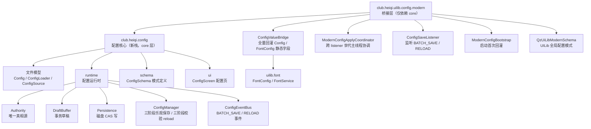
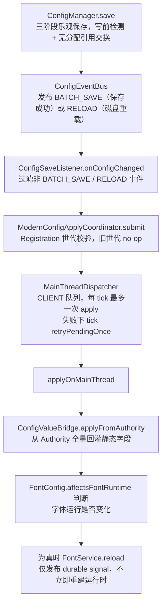

# L1 配置系统：两棵树与保存事务流

一句话定位：配置新栈的两棵树结构（core 文件模型与 uilib 桥接层）及从保存到字体回灌的完整事务流。

> 素材基线：源码实时状态（2026-08-13）。涉及类名可在 `src/main/java` 核对。

## 配置两棵树

## 保存到回灌的事务流

## 图注（真值锚点）

- `Authority` 是唯一真相源；`DraftBuffer` 打开时冻结事务基线，保存时按固定锁序捕获、锁外校验、复锁提交。
- `ConfigEventBus` 通知期间（BATCH_SAVE / RELOAD）`save / flushRaw / reload` 与 Legacy mutation 全部 fail-closed。
- `ConfigSaveListener` 只认 `BATCH_SAVE` 与 `RELOAD`，事件回调不直接回灌，只向协调器 submit。
- `ModernConfigApplyCoordinator` 保证 CLIENT 队列最多一个 apply 任务、同一 drain 内不重复调度；失败留到下一 tick retry，事件不丢。
- `ConfigValueBridge` 本身只做纯回灌，不判断 `affectsFontRuntime`，也不刷 `FontConfig.last*` 快照；判断与收尾是调用方（listener 链）的职责。
- `FontService.reload` 只发布 signal，完整 reconcile 由字体运行时自己的调度器收敛，不等待、不释放 GL。
