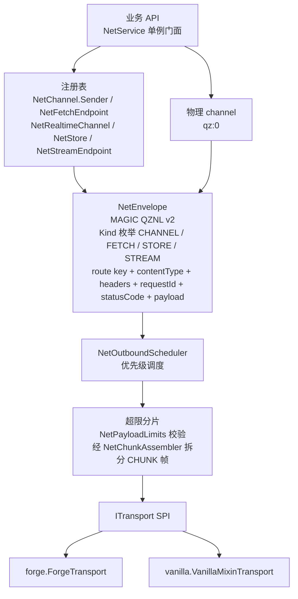
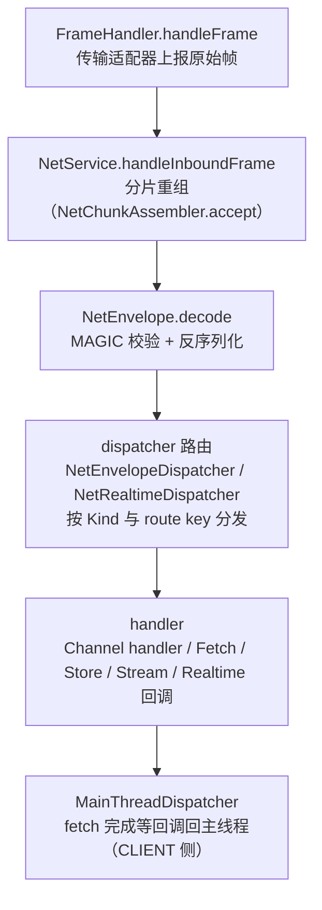
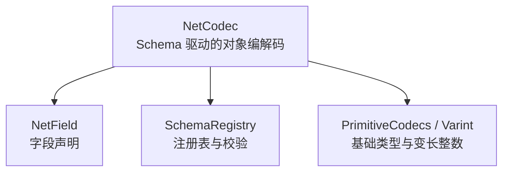

# L1 网络层：出站入站数据流与信封格式

一句话定位：`NetService` 单例门面下的出站调度 / 入站路由两条数据流，及 `NetEnvelope` 信封与编解码。

> 素材基线：源码实时状态（2026-08-13）。涉及类名可在 `src/main/java` 核对。

## 出站数据流

## 入站数据流

## 编解码

## 图注（真值锚点）

- `NetService` 是单例门面，注册表在 freeze 后拒绝新增；物理 channel 常量 `PHYSICAL_CHANNEL` 为 "qz:0"。
- `NetEnvelope` 位于 `club.heiqi.uilib.net.core`（无独立 envelope 子包）；`Kind` 枚举覆盖 CHANNEL、FETCH_REQUEST / FETCH_RESPONSE / FETCH_ERROR、STORE_SNAPSHOT / STORE_DELTA、STREAM_REQUEST / STREAM_START / STREAM_CHUNK / STREAM_ERROR / STREAM_CANCEL 等 wire 类型。
- 超限 payload 出站时经 `NetChunkAssembler` 分片为 CHUNK 帧，入站先重组再解码。
- 传输层通过 `ITransport` SPI 隔离；Forge 与原版（vanilla mixin）各一份实现。
- 网络消息不直接建 Java 类型：body 语义为 HTTP-like 的 JSON / 文本 / 二进制，信封携带完整路由与元数据。
