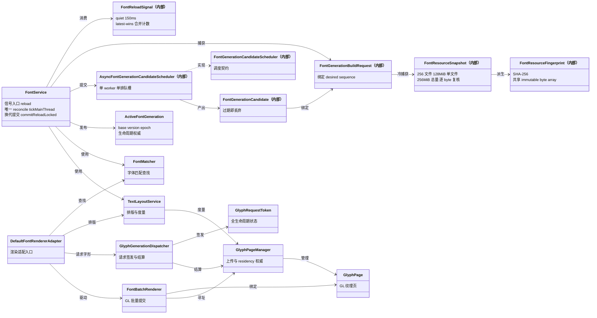

# 字体引擎架构（L1）

L1 骨架视图：`FontService` 是唯一 reconcile 中枢；reload 生命周期（signal → candidate → publication）与 glyph 异步管线（demand → raster → upload → batch）是两条不重叠的执行链。

> 素材基线：源码实时状态（2026-08-13）

## 核心类关系

### 类名简名 → 全路径映射

| 图中简名 | 全路径（`club.heiqi.uilib.` 前缀省略时以此为准） | 可见性 |
|---|---|---|
| `FontService` | `club.heiqi.uilib.font.FontService` | public |
| `FontReloadSignal` | `club.heiqi.uilib.font.FontReloadSignal` | package-private（内部） |
| `FontGenerationBuildRequest` | `club.heiqi.uilib.font.FontGenerationBuildRequest` | package-private（内部） |
| `FontResourceSnapshot` | `club.heiqi.uilib.font.FontResourceSnapshot` | package-private（内部） |
| `FontResourceFingerprint` | `club.heiqi.uilib.font.FontResourceFingerprint` | package-private（内部） |
| `FontGenerationCandidate` | `club.heiqi.uilib.font.FontGenerationCandidate` | package-private（内部） |
| `ActiveFontGeneration` | `club.heiqi.uilib.font.ActiveFontGeneration` | public |
| `FontGenerationCandidateScheduler` | `club.heiqi.uilib.font.FontGenerationCandidateScheduler` | package-private（内部） |
| `AsyncFontGenerationCandidateScheduler` | `club.heiqi.uilib.font.AsyncFontGenerationCandidateScheduler` | package-private（内部） |
| `FontMatcher` | `club.heiqi.uilib.font.util.FontMatcher` | public |
| `TextLayoutService` | `club.heiqi.uilib.font.layout.TextLayoutService` | public |
| `DefaultFontRendererAdapter` | `club.heiqi.uilib.font.api.DefaultFontRendererAdapter` | public |
| `GlyphGenerationDispatcher` | `club.heiqi.uilib.font.glyph.GlyphGenerationDispatcher` | public |
| `GlyphRequestToken` | `club.heiqi.uilib.font.glyph.GlyphRequestToken` | public |
| `GlyphPageManager` | `club.heiqi.uilib.font.page.GlyphPageManager` | public |
| `GlyphPage` | `club.heiqi.uilib.font.page.GlyphPage` | public |
| `FontBatchRenderer` | `club.heiqi.uilib.font.render.FontBatchRenderer` | public |

## reload → 渲染数据流

## 图注

- 完整 reload 固定发生在 `RenderTick.END`；Splash 活跃只延后 reconcile、不丢 signal；draw-stage 不推进 generation。
- 仅 cold snapshot（`current == null`）可创建首次字体目录；已有 active 时目录缺失或读取失败 fail-closed 保留旧代。
- snapshot 上限：256 文件 / 单文件 128 MiB / 总 256 MiB；捕获后复核 file key、size、mtime，并逐 byte 二次读取拒绝并发改写。
- fingerprint（SHA-256）与 AWT parser 直接消费同一 immutable byte array，无整数组复制。
- candidate flight 绑定 desired sequence + active base version/epoch + settings identity + resource fingerprint；过期 candidate 直接丢弃。
