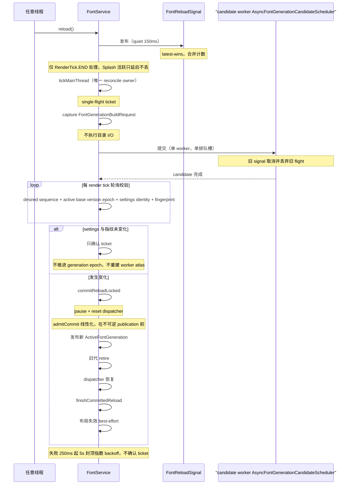
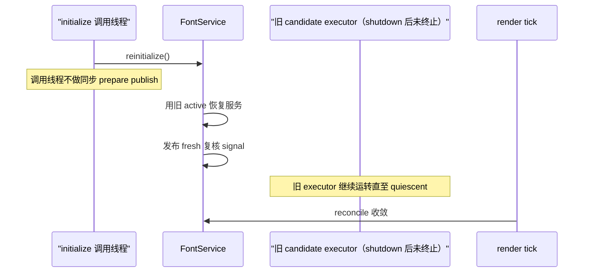

# 字体异步时序（L2）

L2 时序视图：一次 reload 从任意线程信号到 render tick 唯一 reconcile、再到 candidate 校验与不可逆 commit 的完整生命周期，以及 shutdown 后 reinitialize 的特殊收敛路径。

> 素材基线：源码实时状态（2026-08-13）

## reload reconcile 生命周期

## reinitialize 特殊路径

## 图注

- 失败退避从 250ms 开始、5s 封顶的指数 backoff，且失败不确认 ticket，避免静默丢换代。
- 换代 defer 条件：frame lease 未归零、旧 batch 未 flush、retiring atlas page ownership 未释放。
- atlas ownership 硬上限为 active + retiring；retiring ownership 不阻塞 fingerprint no-op ticket 确认。
- commit 前的校验（desired sequence、active base version/epoch、settings identity、fingerprint）全部未变化时，只确认 ticket，不做任何 generation/epoch 推进，也不重建 worker 或 atlas。
