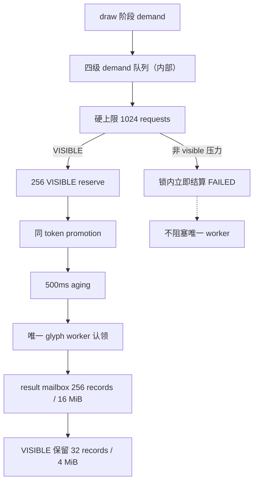
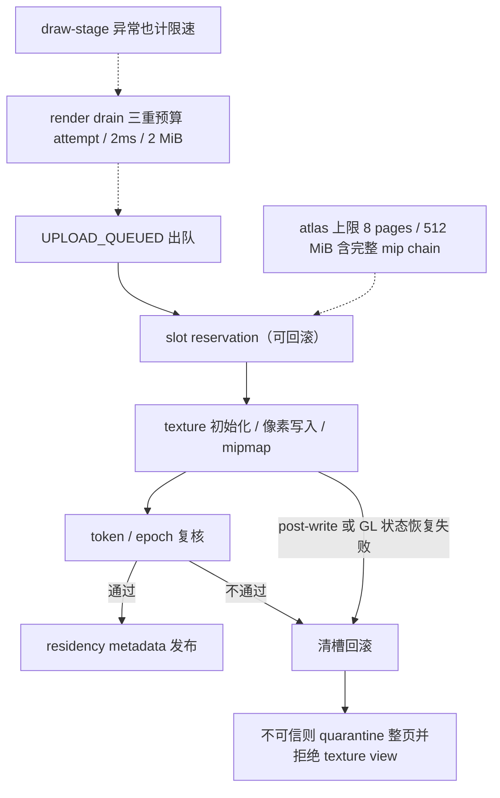

# glyph 状态机与上传（L2）

L2 状态视图：`GlyphRequestToken` 的终态结算状态机、demand 有界调度与 upload 事务三条链路，共同约束字形从请求到 residency 的全程。

> 素材基线：源码实时状态（2026-08-13）

## GlyphRequestToken 状态机

```mermaid
stateDiagram-v2
    [*] --> ABSENT
    ABSENT --> QUEUED: demand 入队
    QUEUED --> RASTERIZING: worker 认领
    RASTERIZING --> UPLOAD_QUEUED: 位图产出
    UPLOAD_QUEUED --> UPLOADING: 上传出队
    UPLOADING --> RESIDENT: residency 发布
    UPLOADING --> NO_BITMAP: 无位图结果
    QUEUED --> FAILED: 失败结算
    RASTERIZING --> FAILED: 失败结算
    UPLOAD_QUEUED --> FAILED: 失败结算
    UPLOADING --> FAILED: 失败结算
    QUEUED --> CANCELLED_STALE: 换代取消
    RASTERIZING --> CANCELLED_STALE: 换代取消
    UPLOAD_QUEUED --> CANCELLED_STALE: 换代取消
    UPLOADING --> CANCELLED_STALE: 换代取消
    RESIDENT --> [*]
    NO_BITMAP --> [*]
    FAILED --> [*]
    CANCELLED_STALE --> [*]
```

## demand 有界调度

## upload 事务

## 图注

- 所有终态（`RESIDENT`/`NO_BITMAP`/`FAILED`/`CANCELLED_STALE`）按完整 token + expected state 结算；stale token 不能改同码点新请求的状态。
- 四级 demand（`VISIBLE`/`FOREGROUND`/`PREFETCH`/`WARMUP`）为内部语义，由 `GlyphDemandLevel`（package-private）承载。
- 非 visible 压力在锁内立即结算 `FAILED`，绝不进入唯一 glyph worker 的队列阻塞其运转。
- upload 事务以可回滚 slot reservation 开头：texture 初始化、像素写入、mipmap 任一失败，或 post-write/GL 状态恢复失败，都清槽回滚；页面不可信时 quarantine 整页并拒绝 texture view。
- render drain 受 attempt / 2ms / 2 MiB 三重预算限速，draw-stage 内发生的异常同样计入限速。
