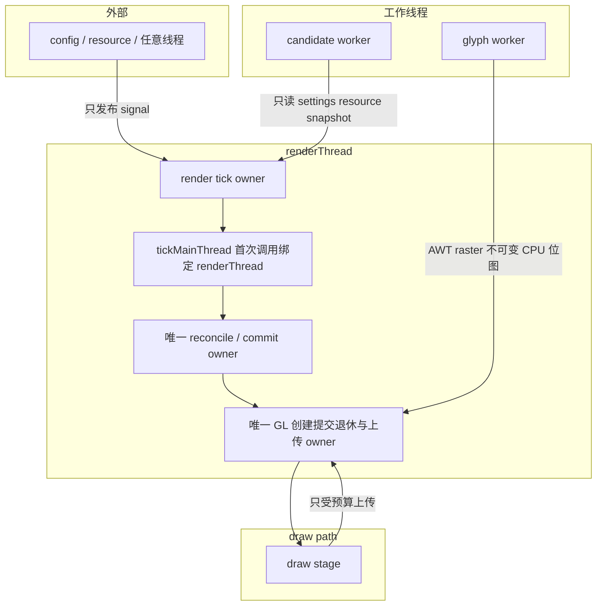

# 线程与所有权（L2）

L2 线程模型视图：五个参与者各司其职——外部线程只发信号、render tick owner 独占 reconcile/commit/GL 生命周期、draw path 只受预算上传、两个 worker 分别只产出纯 CPU 结果与只读快照。

> 素材基线：源码实时状态（2026-08-13）

## 参与者与所有权流向

## 参与者权限表

| 参与者 | 允许 | 禁止 |
|---|---|---|
| 外部线程（config / resource） | 只发布 reload signal | reconcile、commit、GL 操作、上传 |
| render tick owner | 唯一 reconcile / commit / GL 退休 / 上传 owner；`tickMainThread` 首次调用绑定 renderThread | 错误线程调用 fail-closed |
| draw path（draw stage） | 只受预算上传、只读 residency | 推进 generation |
| glyph worker | 仅 AWT raster，产出不可变 CPU 结果 | 任何 GL 调用 |
| candidate worker | 只读 settings / resource snapshot | 接触 MC / GL live 对象 |

## 图注

- shutdown 停 worker 并封锁 lifecycle；无 GL context 时不删 GL 资源——所有 GL 只由 render-thread owner 创建、提交、退休。
- `SceneParallelExecutor` 是预留并行基建，`PARALLEL_ENABLED = false`，布局与 paint 全串行。
- 上传所有权在 render tick owner：glyph worker 只把不可变 CPU 位图交给 mailbox，从不触碰纹理。
