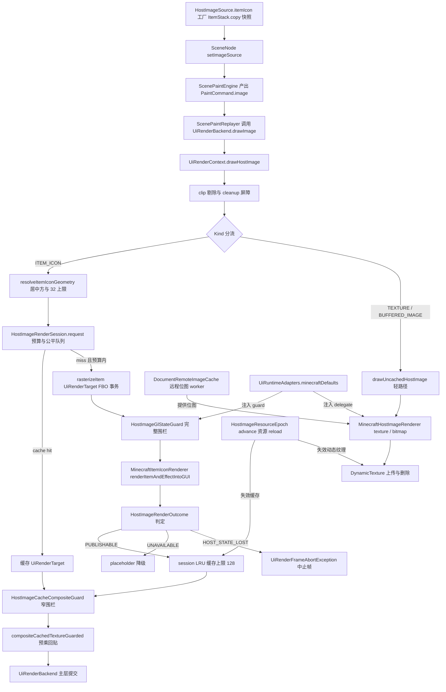
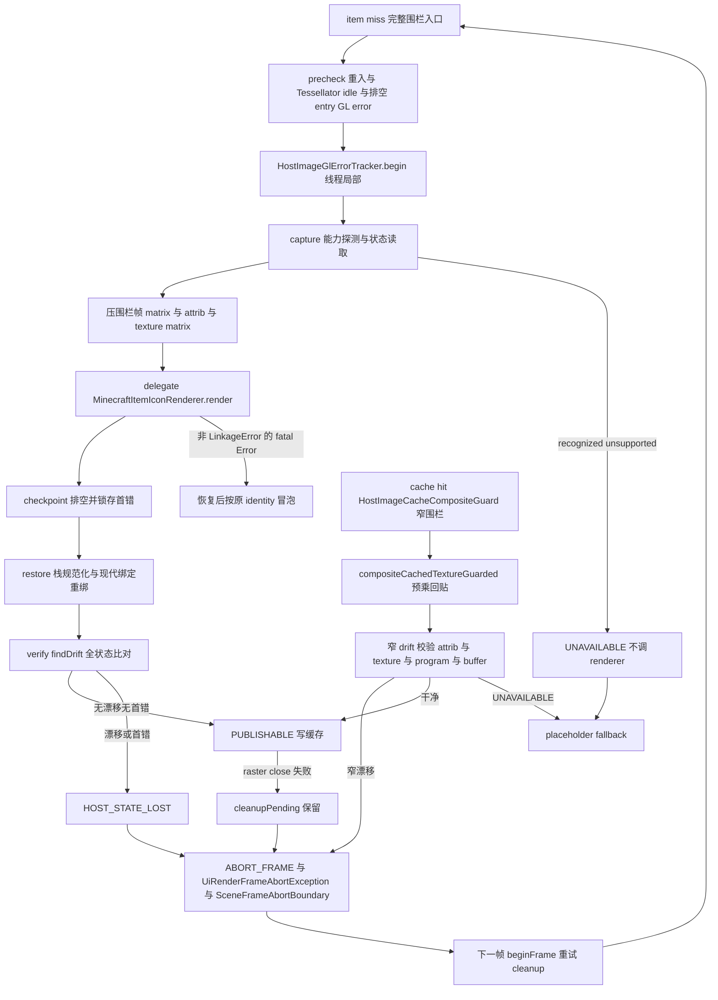

# 物品渲染包装（L1）

L1 骨架视图：`HostImageSource.itemIcon(ItemStack)` snapshot 工厂 → scene paint/replay → `UiRenderContext` 预算化栅格 → 静态 icon 缓存（composite cache + epoch 失效）→ 纹理/FBO 生命周期，以及完整围栏（item miss）与窄围栏（cache hit）两条 GL 状态隔离路径。

> 素材基线：源码实时状态（2026-08-13）

## 核心逻辑主链路



## GL 状态隔离与失败路径



## 失败-重试状态机

状态为 `HostImageRenderSession.RequestResult.Status`（`CACHE_HIT`/`RASTERIZED`/`PLACEHOLDER`/`UNAVAILABLE`/`ABORT_FRAME`），转移由 `HostImageRenderOutcome.Status`（`PUBLISHABLE`/`UNAVAILABLE`/`HOST_STATE_LOST`）与 cleanup 结果决定。

```mermaid
stateDiagram-v2
    [*] --> "请求入点"
    "请求入点" --> CACHE_HIT: identity key 命中
    "请求入点" --> ABORT_FRAME: cleanup 失败或待重试
    "请求入点" --> UNAVAILABLE: 非法参数或 cooldown 内
    "请求入点" --> PLACEHOLDER: 预算让位或排队头
    "请求入点" --> "栅格尝试": 队头且预算内
    "栅格尝试" --> RASTERIZED: PUBLISHABLE 且 raster 非空
    "栅格尝试" --> UNAVAILABLE: UNAVAILABLE 结果写 5 秒 cooldown
    "栅格尝试" --> ABORT_FRAME: HOST_STATE_LOST 不降级
    "栅格尝试" --> ABORT_FRAME: raster close 失败保留重试
    CACHE_HIT --> [*]
    PLACEHOLDER --> [*]
    UNAVAILABLE --> [*]
    RASTERIZED --> [*]
    ABORT_FRAME --> "下一帧重试"
    "下一帧重试" --> "请求入点": beginFrame 清 cooldown 与重试 cleanup
```

## 类名简名 → 全路径映射

| 图中简名 | 全路径（`club.heiqi.uilib.` 前缀） | 可见性 |
|---|---|---|
| `HostImageSource` | `ui.image.HostImageSource` | public |
| `HostImageRenderSession` | `ui.image.HostImageRenderSession` | public |
| `HostImageRenderOutcome` | `ui.image.HostImageRenderOutcome` | public |
| `HostImageGlStateGuard` | `ui.image.HostImageGlStateGuard` | public |
| `HostImageGlErrorTracker` | `ui.image.HostImageGlErrorTracker` | package-private |
| `ItemIconRenderer` | `ui.image.ItemIconRenderer` | public |
| `MinecraftItemIconRenderer` | `ui.image.MinecraftItemIconRenderer` | public |
| `HostImageRenderer` | `ui.image.HostImageRenderer` | public |
| `MinecraftHostImageRenderer` | `ui.image.MinecraftHostImageRenderer` | public |
| `DocumentRemoteImageCache` | `ui.image.DocumentRemoteImageCache` | public |
| `HostImageResourceEpoch` | `internal.image.HostImageResourceEpoch` | public（internal） |
| `HostImageCacheCompositeGuard` | `internal.image.HostImageCacheCompositeGuard` | public（internal） |
| `UiRenderContext` | `ui.render.UiRenderContext` | public |
| `UiRenderTarget` | `ui.render.UiRenderTarget` | public |
| `PaintContextCompositor` | `ui.render.PaintContextCompositor` | public |
| `UiRuntimeAdapters` | `ui.runtime.UiRuntimeAdapters` | public |
| `ScenePaintReplayer` | `ui.scene.paint.ScenePaintReplayer` | public |
| `ScenePaintEngine` | `ui.scene.paint.ScenePaintEngine` | public |
| `SceneNode` | `ui.scene.node.SceneNode` | public |
| `SceneFrameAbortBoundary` | `ui.screen.SceneFrameAbortBoundary` | package-private |
| `MixinFontRenderer` | `mixin.early.MixinFontRenderer` | mixin |

## 图注

### 真值锚点（源码事实）

- snapshot-only 成立：`HostImageSource.java:64-70` 工厂先判 null 再执行 `itemStack.copy()`，返回后不再读取调用方 mutable stack；`:138-140` getter 返回防御副本。main 源码中 `itemIcon(` 唯一调用点即工厂本身，无内部消费。
- 缓存不读内容：`HostImageRenderSession.java:378-396` `CacheKey` 只含 source identity 与 rasterSide，equals 故意不委托 source；会话 javadoc 承诺绝不读 registry/NBT/显示名。
- 几何：`UiRenderContext.java:1101-1109` `destinationSide = min(w,h)`、`rasterSide = min(destinationSide, 32)`，raster 等比合成居中回贴。
- clip 外不排队：`UiRenderContext.java:637-640` 完全在有效 clip 外的 ITEM_ICON 请求直接 return。
- 完整/窄围栏分工：`UiRenderContext.java:67-68` 声明两个 guard 字段；`:708` item miss 栅格化走 `itemIconStateGuard` 完整围栏；`:682-685` cache hit 回贴走 `cacheCompositeStateGuard` 窄围栏，不调用 `RenderItem` 或完整状态查询。
- 发布与降级：`HostImageRenderSession.java:179-199` 只有 publishable 且 raster 非空才写缓存；`HOST_STATE_LOST` 不写 cooldown、直接 `ABORT_FRAME`，下一帧必须重新探测。
- cooldown：`HostImageRenderSession.java:21` `FAILURE_COOLDOWN_NANOS = 5s`，`:196-197` 写入、`:291-297` 表容量有界；过期条目在 `beginFrame` 清除。
- 资源 epoch：`MixinFontRenderer.java:28-35` 在 `FontRenderer.onResourceManagerReload` RETURN 注入 `HostImageResourceEpoch.advance()`；`PaintContextCompositor.java:56-68` 在 `beginFrame` 检测 epoch 变化清空 item 会话缓存（有 pending cleanup 时跳过且不推进局部 epoch，下帧再试）；`MinecraftHostImageRenderer.java:124-131` 惰性清理动态 bitmap 纹理，删除失败不推进局部 epoch。
- 双栈删除确认：main 源码 grep 无 `LIVE` 标识与旧 seam；不存在 `ui.inventory`/`ui.slot` 包；`EarlyMixinsTest` 断言 mixin 列表无 GuiContainer 注入；`UiRuntimeAdapters.java:52-55` 默认只构造普通 renderer 与 item icon renderer 两个委托。
- HUD 宿主：`UiHudRenderListener.java:86` 用六参构造创建 `UiRenderContext`（内部为 `UiRuntimeAdapters.empty()`），因此 HUD 中 item icon 恒显示 placeholder。
- 动态纹理生命周期：`MinecraftHostImageRenderer.java:119-158` `close()` 与 reload 均删除全部上传纹理，单条删除失败保留该条目供下次重试；`UiRuntimeAdapters` 的 `OwnedResources` 保证 minecraftDefaults 派生族 exactly-once 关闭。
- zLevel：`MinecraftItemIconRenderer.java:21` `GUI_ITEM_Z_LEVEL = 100`；`:77-85` `runWithGuiItemDepth` 无条件 finally 恢复调用前深度。
- 重入保护：`HostImageGlStateGuard.java:55-57` 同线程围栏重入在任何 GL 查询前直接抛 `IllegalStateException`。
- fatal 冒泡：`HostImageGlStateGuard.java:244-252` 非 `LinkageError` 的 `Error` 在 best-effort 恢复后按原 identity 抛出，不转为 typed outcome。

### 审查边界与未确认

- P0：未发现（无崩溃/数据破坏/GL 污染且无防护的问题）。
- P1：未发现（无合同破坏、泄漏或竞态级问题）。
- P2（按影响排序）：
  1. HUD 帧中止路径与 screen 不对称：`UiHudRenderListener.renderHudFrame`（:86-98）未用 `SceneFrameAbortBoundary`，`UiRenderFrameAbortException` 会作为普通 RuntimeException 重抛进 Forge 事件。当前 HUD 使用空适配器使 item icon 恒 placeholder，触发面小，但 `abortIfLayerCleanupPending`（UiRenderContext.java:1066）仍可在 HUD 抛出该异常。涉及 `UiHudRenderListener`、`UiRenderContext`。
  2. `DocumentRemoteImageCache` 无任何测试类；`completionCallback` 在下载 worker 线程执行（:181-212），消费方需自行回主线程；`clear()` 不取消在途任务，在途完成后成为孤儿条目，下次 request 重新下载。
  3. `bufferedImage` 工厂保存可变 `BufferedImage` 引用（`HostImageSource.java:116-127`）；`MinecraftHostImageRenderer` 仅按 `imageKey` 缓存 DynamicTexture（:103-116），同 key 图像内容变化不会重新上传，直到 reload/close。
  4. `HostImageCacheCompositeGuard` 的 texture binding 恢复依赖 `glPushAttrib(GL_TEXTURE_BIT)`（:41-42），其 drift 校验（:166-200）与完整围栏恢复项均只有 FakeStateAccess 单测，无真实 GL 上下文验证。
  5. `logHostImageFailure`（UiRenderContext.java:1143-1153）每次失败调用 `source.getItemIconStack()` 做防御拷贝，仅用于日志，失败路径有轻微分配开销。
  6. `DocumentRemoteImageCache` 无按时间过期，只有 128 条 LRU 修剪与断连 `clear()`（:32-33、:214-240）。
  7. Tessellator idle 判定依赖反射字段 `isDrawing`/`field_78415_z`（`HostImageGlStateGuard.java:352-356`），两种映射均失败时 fail-closed 使 item icon 全部不可用。
  8. `MinecraftItemIconRenderer` 只调 `renderItemAndEffectIntoGUI`（:57-58），icon-only 成立；若未来改调 `renderItemOverlayIntoGUI` 会破坏「不绘 count/durability」合同，现仅 op 名序列断言，无防回归测试。
- 未确认：
  - 完整围栏 `LwjglStateAccess` 的 capture/restore/findDrift 全链路（含 capability 探测）无真实 GL 集成测试，「支持范围内宿主状态验证」完备性需真机确认。
  - HUD 帧中止策略（重抛 vs 优雅中止）未在任何文档中声明为设计选择。
  - `DocumentRemoteImageCache.request` 在 main 内无消费者（仅 `ClientProxy` 调用 clear/shutdown），其文档 img src 远程图语义需下游业务验证。
