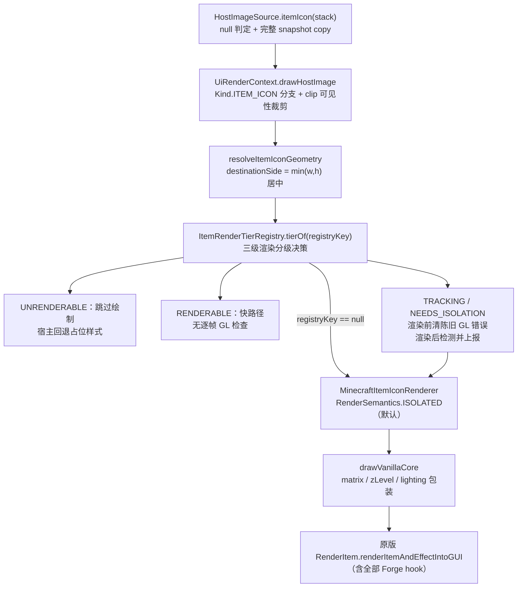
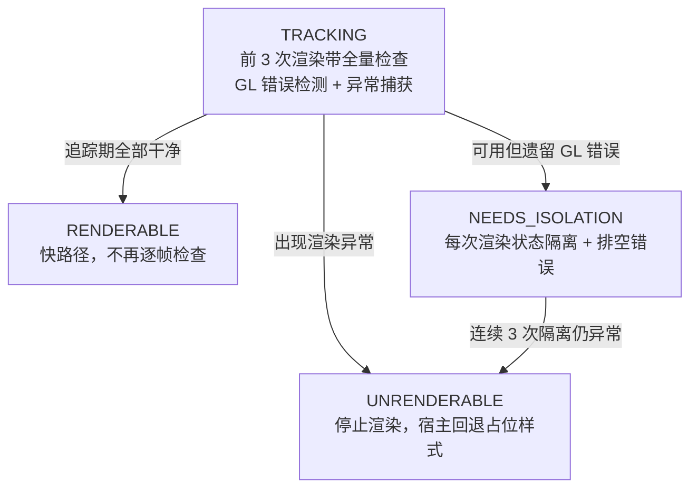

# L1 物品渲染包装：当帧直绘完整委托与渲染分级

一句话定位：ItemStack 图标从 scene 层到原版 RenderItem 的完整委托链——snapshot 工厂 → 当帧直绘 → 三级追踪分级 → 原版 `renderItemAndEffectIntoGUI`。

> 素材基线：源码实时状态（2026-08-18）。此前版本描述的「isPlain2DIcon 分流 + 2D 等价自绘」已整体重构移除，本文为重构后的现行机制。

## 数据流（当帧直绘）

## 渲染核心：完整原版委托

`MinecraftItemIconRenderer.drawVanillaCore` 是唯一绘制实现——3D block、多 pass 与纯 2D 图标
**一律完整委托**原版 `RenderItem.renderItemAndEffectIntoGUI`（含 matrix / zLevel / lighting 包装与
全部 Forge hook），不再有 UILib 自绘复刻。包装序列：

1. `pushMatrix` → translate/scale（`side / 16` 等比缩放）
2. `enableGuiStandardItemLighting` + `setLightmapTextureCoords(240, 240)` + `enableDepthTest`（与原版 GuiContainer 槽位绘制一致）
3. 原版 `renderItemAndEffectIntoGUI`（`finally` 中 `disableStandardItemLighting`）
4. `matrixModeModelView` + `popMatrix`（`finally` 保证）

深度契约：`GUI_ITEM_Z_LEVEL = 100.0F` 与原版 GUI 物品渲染对齐；`runWithGuiItemDepth`
无条件 `finally` 恢复调用前深度，异常路径同样恢复。

## 两种渲染语义（RenderSemantics）

| 语义 | 行为 | 适用 |
|---|---|---|
| `VANILLA` | 直接执行核心，不做任何 GL 清理；终态与原版调用逐位一致（保留全部残留：blend/alpha test/当前颜色/纹理绑定/shade model 等） | 需要与原版逐位一致的场景 |
| `ISOLATED`（默认） | 核心外包 `GlStateScope`：入口态快照（`glPushAttrib(GL_ALL_ATTRIB_BITS)` + 纹理绑定 / active texture / client-active texture 手动快照），`finally` 恢复，异常路径同样恢复 | 通用 UI 场景 |

## 渲染分级：ItemRenderTierRegistry

平台中立（只认稳定字符串键，不依赖 Minecraft/LWJGL 类型；键由 `HostImageSource.registryKey()` 派生）。
每个 registryKey（物品注册名:meta 等）**三次追踪 → 永久分级**（`TRACK_ATTEMPTS = 3`）：

- 上报通道：`Outcome.OK / GL_ERROR / EXCEPTION` → `classify`
- 分级变化经 `Listener.onClassification` 通知宿主（如选择器列表把不可渲染项回退占位样式）
- `NEEDS_ISOLATION` 连续 `ISOLATION_FAILURE_LIMIT = 3` 次异常升级 `UNRENDERABLE`
- 分级会话内永久记忆；测试用 `resetForTests()` 清零

## 合同与兜底（真值锚点）

- **icon-only**：不绘制数量、耐久条、tooltip、carried 与槽位交互语义；source 创建时复制完整 snapshot。
- **无缓存 / 无占位 / 无 FBO 栅格化**：当帧直绘到当前主层；不可渲染项由宿主回退占位样式，不画占位图。
- **空能力路径**：`UiRuntimeAdapters.empty()` / HUD 空能力路径跳过绘制，不崩溃。
- **单物品失败不中断整帧**：渲染异常 `classify(EXCEPTION)` 后原样抛出，由 `ScenePaintReplayer` 的逐命令隔离 catch 兜底。
- `registryKey == null`（非物品图标或无名物品）：照常渲染，不参与分级追踪。
