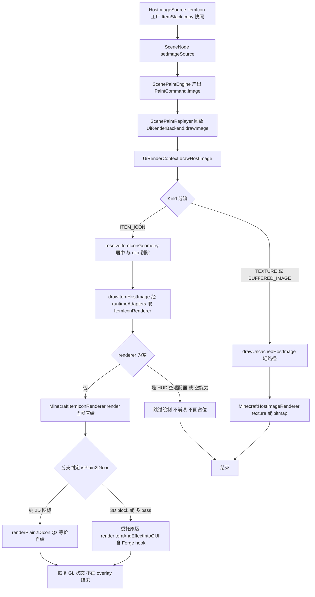
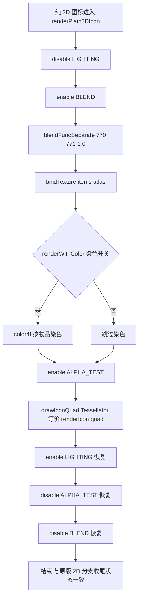

# 物品渲染包装（上层替换）

L1 骨架视图：`HostImageSource.itemIcon(ItemStack)` snapshot 工厂 → scene paint/replay → `UiRenderContext.drawHostImage` → `MinecraftItemIconRenderer` 当帧直绘（纯 2D 图标 Qz 等价自绘，3D block / 多 pass 委托原版），无 FBO、无缓存、无占位，overlay 保持 icon-only 合同不绘制。

> 素材基线：源码实时状态（2026-08-13）

## 核心逻辑主链路

## 2D 等价自绘 GL 动作与恢复序列

## 类名简名 → 全路径映射

| 图中简名 | 全路径（`club.heiqi.uilib.` 前缀） | 可见性 |
|---|---|---|
| `HostImageSource` | `ui.image.HostImageSource` | public |
| `ItemIconRenderer` | `ui.image.ItemIconRenderer` | public |
| `MinecraftItemIconRenderer` | `ui.image.MinecraftItemIconRenderer` | public |
| `MinecraftHostImageRenderer` | `ui.image.MinecraftHostImageRenderer` | public |
| `UiRenderContext` | `ui.render.UiRenderContext` | public |
| `UiRenderBackend` | `ui.render.UiRenderBackend` | public |
| `UiRuntimeAdapters` | `ui.runtime.UiRuntimeAdapters` | public |
| `UiHudRenderListener` | `client.UiHudRenderListener` | public |
| `ScenePaintReplayer` | `ui.scene.paint.ScenePaintReplayer` | public |
| `ScenePaintEngine` | `ui.scene.paint.ScenePaintEngine` | public |
| `SceneNode` | `ui.scene.node.SceneNode` | public |

## 图注

### 真值锚点（源码事实）

- snapshot 语义：`HostImageSource.java:64-70` 工厂先判 null 再执行 `itemStack.copy()`，返回后不再读取调用方 mutable stack；`:138-140` getter 返回防御副本。main 源码中 `itemIcon(` 唯一调用点即工厂本身，无内部消费。
- 当帧直绘：`UiRenderContext.java:621-657` `drawHostImage` 对 ITEM_ICON 走 `drawItemHostImage` 立即调用 renderer（无缓存、无占位、无 FBO 栅格化）；renderer 为空时跳过（不崩溃、不画占位）。
- 几何与剔除：`UiRenderContext.java:894-902` `destinationSide = min(w,h)` 并在目标矩形中居中；`:628-631` 完全在有效 clip 外的 ITEM_ICON 请求直接 return。
- 分支判定：`MinecraftItemIconRenderer.java:117-122` `isPlain2DIcon` 与原版 `RenderItem.renderItemIntoGUI`（:426/:473）等价——3D block（itemSpriteNumber==0 且 `RenderBlocks.renderItemIn3d`）或多 pass（`requiresMultipleRenderPasses`）为假，其余为纯 2D 图标。
- 2D 等价自绘：`MinecraftItemIconRenderer.java:157-173` `renderPlain2DIcon` 的 GL 动作与恢复序列见上图；结束状态与原版 2D 分支（:557-559，LIGHTING enable / ALPHA_TEST disable / BLEND disable）一致。
- 3D / 多 pass 委托：`MinecraftItemIconRenderer.java:96-101` GUI 标准光照成对开闭，委托持有的原版 `RenderItem` 实例 `renderItemAndEffectIntoGUI`（含 Forge hook 与全部原版行为）。
- zLevel 与矩阵：`MinecraftItemIconRenderer.java:35` `GUI_ITEM_Z_LEVEL = 100`；`:176-184` `runWithGuiItemDepth` 无条件 finally 恢复调用前深度；`:87-107` pushMatrix / translate / scale 与 popMatrix 成对。
- icon-only：只调 item/effect 渲染，不调 `renderItemOverlayIntoGUI`；数量、耐久条与 2D 路径附魔 glint 均不绘制。
- 空能力跳过：`MinecraftItemIconRenderer.java:46-57` null 参数、无效 side 或 `Minecraft.getMinecraft()` 为空时跳过；2D 路径取不到 atlas 能力时跳过（:71-80，missingno 兜底 :142-154）；3D 路径 `canRenderItemAndEffect` 不满足时跳过（:82-84）。
- 无缓存/无占位：item icon 路径无 FBO、无缓存、无占位、无预算/cooldown、无帧中止；`UiRenderContext.java:612-613` 明确「当帧直绘、无缓存、无占位、无 FBO 栅格化」。

### 审查边界与未确认（真机未验证，2026-08-13）

- 2D 等价自绘的 GL 动作与恢复序列仅经纯 JVM 测试（`ItemGlOps` / `ItemRenderHost` 注入面记录动作）验证，未在真实 GL 上下文逐项对照原版 2D 分支。
- 2D 路径不再绘制附魔 glint（与原版 2D 图标分支一致），未真机验证。
- 3D / 多 pass 委托（`renderItemAndEffectIntoGUI` 含 Forge hook 与 GUI 标准光照开闭）无单元测试，未真机验证。
- HUD 空能力路径（`UiHudRenderListener.java:86` 经 `UiRuntimeAdapters.empty()` 构造 context，itemIconRenderer 为空直接跳过）未真机验证。
- `drawIconQuad` 经 Tessellator 批绘制，与宿主帧内其他 Tessellator 使用者的批交互未真机验证。
