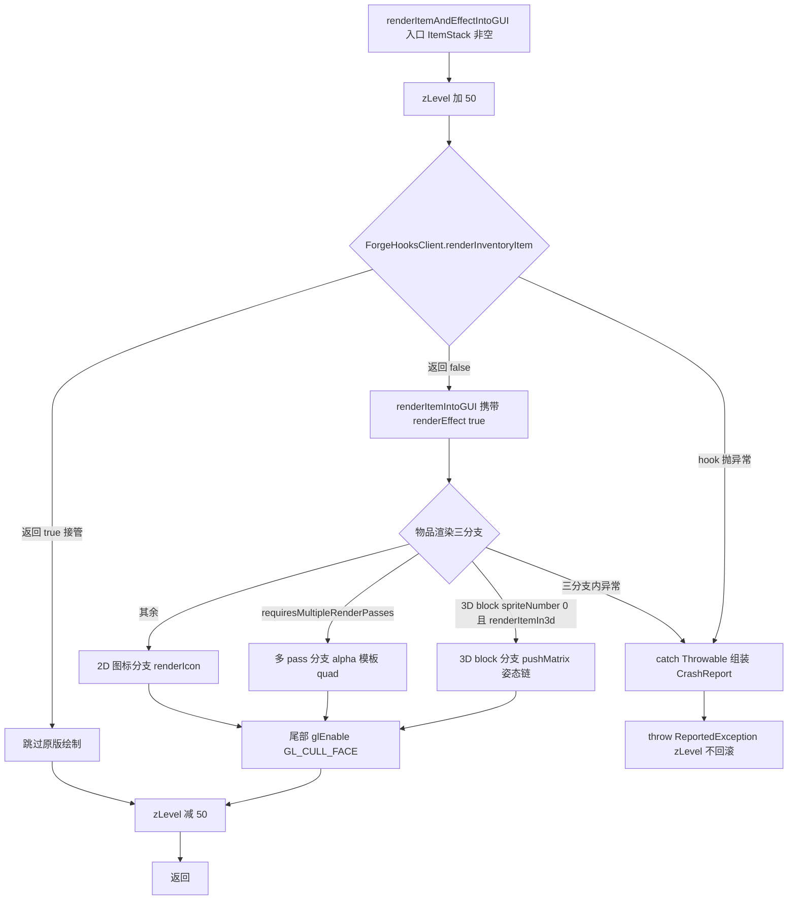
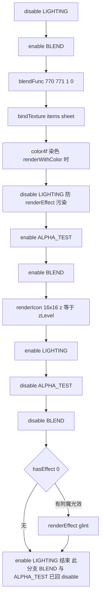
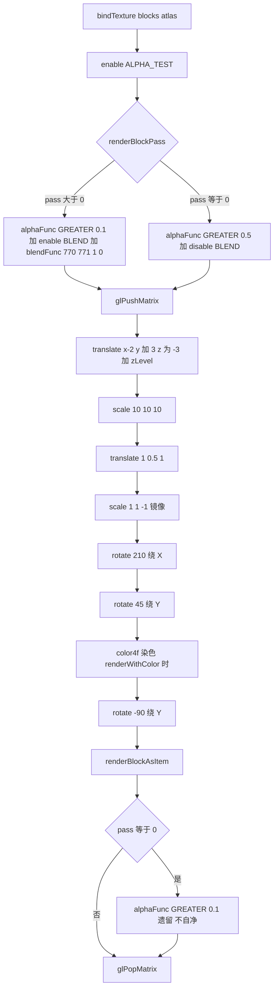
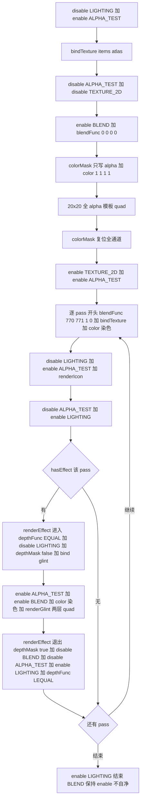
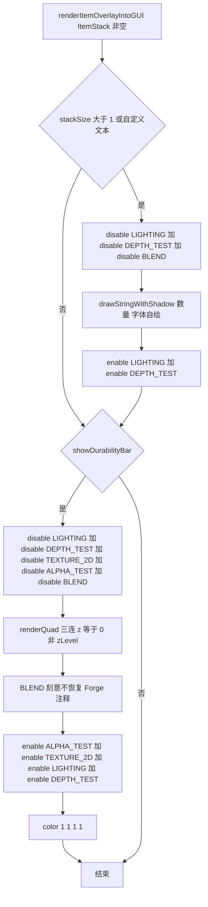

# 原版物品渲染流程（参照图）

以 1.7.10 原版 `RenderItem` 为参照基线，梳理 GUI 物品渲染的入口链、三条绘制分支与 GL 状态自净情况，供 Qz-UILib 围栏逐项对照。

> 素材基线：build/rfg/minecraft-src RenderItem.java（1.7.10 反编译，2026-08-13）

## 图 1 总览：renderItemAndEffectIntoGUI 全链

## 图 2 2D 图标分支细节（:528-565）

## 图 3 3D block 分支细节（:428-471）

## 图 4 多 pass 分支与 glint（:473-526 + renderEffect）

## 图 5 overlay：数量与耐久条（:700-739）

## 图注：自净 vs 不自净

| 状态项 | 原版行为 | 自净? |
|---|---|---|
| zLevel | 正常路径 :579 加 50 与 :644 减 50 成对；异常路径 catch 后抛 ReportedException 不回滚 | 部分（异常不自净） |
| BLEND | 2D 图标分支成对 disable 回滚；多 pass 分支 :480 enable 后结束不回滚；overlay 耐久条 :731 刻意不恢复 | 不自净（2D 分支除外） |
| ALPHA_TEST | 2D 与多 pass 分支成对 disable 回滚；3D block pass0 :468 遗留 alphaFunc GREATER 0.1 不还原 | 部分（3D pass0 不自净） |
| LIGHTING | 三个分支结束均 enable 回滚 | 自净 |
| CULL_FACE | :568 恒 enable 永不恢复 | 不自净 |
| TEXTURE_2D | 多 pass 模板段与 overlay 耐久条段均成对 enable 回滚 | 自净 |
| colorMask | 多 pass 模板段 :482 只写 alpha 后 :492 复位全通道 | 自净 |
| color | overlay 耐久条末 :736 显式 color 1 1 1 1 | 自净 |
| DEPTH_TEST | overlay 数量段 :708 禁用 :712 恢复成对 | 自净 |
| depthFunc 与 depthMask | renderEffect :650-662 进入与退出对称成对 | 自净 |
| 矩阵栈 | 3D block 分支 :444 pushMatrix 与 :471 popMatrix 成对 | 自净 |

原版不自净项依赖宿主每帧重设（GuiContainer.drawScreen），Qz 围栏以 attrib 帧+texture binding 恢复替代。
