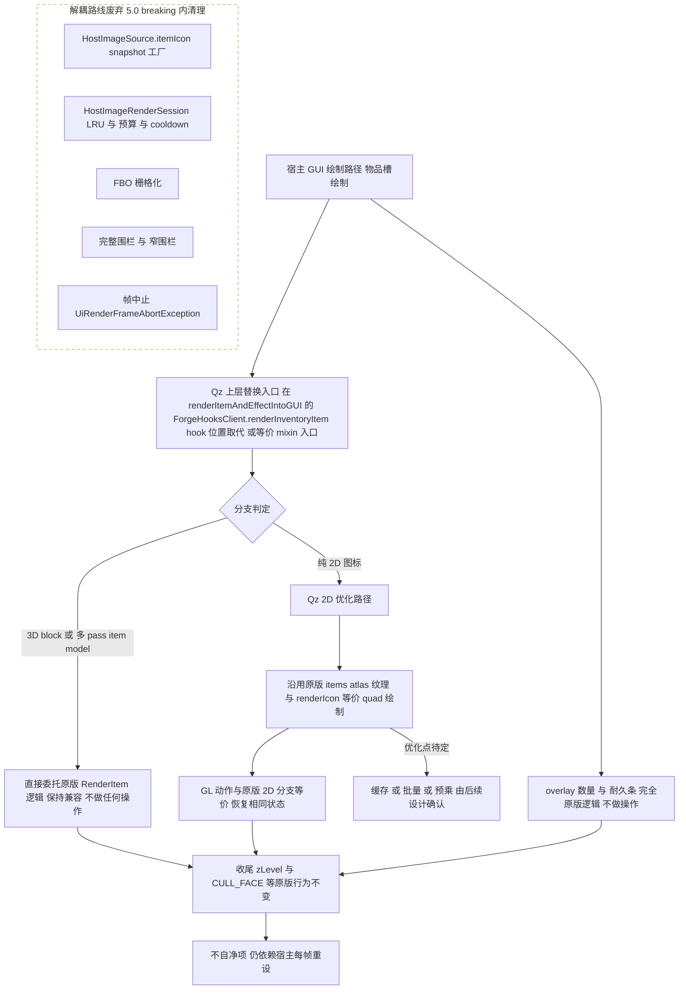

# 物品渲染上层替换大纲（草案）

定位：只在 Forge 物品渲染入口做上层替换，纯 2D 图标路径由 Qz 侧优化、其余路径与 overlay 保持原版行为不变，并整体废弃原解耦（snapshot / FBO / 围栏）路线。

> 状态：草案，待评审。素材基线：09-原版物品渲染流程.md（2026-08-13）

## 图 1 总纲

## 图注

1. **各分支 GL 责任与自净契约**
   - 2D 优化路径只允许触碰原版 2D 分支同等的状态项，结束时必须恢复自己修改的 lighting、BLEND、ALPHA_TEST 与 texture binding，收尾状态与原版 2D 分支一致（对照 09 图 2：分支结束 BLEND 与 ALPHA_TEST 回 disable、LIGHTING 回 enable）。
   - 3D block 与多 pass 分支完全原版逻辑，原版已知不自净项保持原样（3D pass0 alphaFunc GREATER 0.1 遗留、多 pass BLEND 结束不回滚），Qz 不引入新差异也不额外修复。
   - overlay 完全原版逻辑：数量 drawStringWithShadow、耐久条三连 quad 及 BLEND 刻意不恢复等行为不变。
   - 收尾：zLevel 加 50 减 50 成对、CULL_FACE 恒 enable 不恢复等原版行为不变；不自净项仍依赖宿主每帧重设（GuiContainer.drawScreen）。

2. **兼容性承诺**
   - 3D block、多 pass item model、overlay 的渲染结果与行为保持不变。
   - Forge IItemRenderer 行为保持不变；若 Qz 取代 hook 点（原版 :583 位置），第三方 IItemRenderer 如何继续生效——待定。

3. **废弃清单与公共 API 影响**
   - 整体废弃：HostImageSource.itemIcon snapshot 工厂、HostImageRenderSession（LRU / 预算 / cooldown）、FBO 栅格化、完整围栏（HostImageGlStateGuard）与窄围栏（HostImageCacheCompositeGuard）、帧中止（UiRenderFrameAbortException）；《物品渲染简化方案大纲》随本路线一并作废。
   - HostImageSource.itemIcon 等公共 API 是否移除、5.0 breaking 范围——待用户确认。

4. **待定问题列表**
   - 2D 优化的具体内容（缓存 / 批量 / 预乘），由后续设计确认。
   - hook 取代形式：mixin 还是 Forge 注册。
   - 第三方 IItemRenderer 兼容策略。
