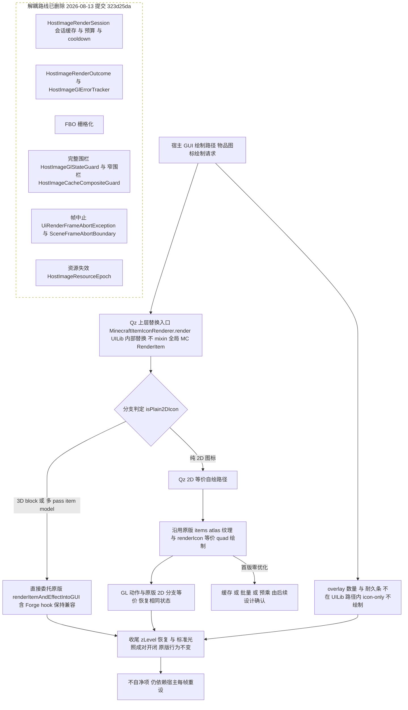

# 物品渲染上层替换大纲

定位：只在 UILib 物品渲染入口做上层替换（不 mixin 全局 MC `RenderItem`），纯 2D 图标路径由 Qz 等价自绘、3D block / 多 pass 委托原版、overlay 保持 icon-only 不绘制，并整体删除原解耦（FBO / 缓存 / 围栏）路线。

> 状态：已实施首版（2026-08-13，提交 323d25da），缓存/批量/预乘待后续。素材基线：09-原版物品渲染流程.md（2026-08-13）
>
> **后续演进（2026-08-17 后）**：图 1 的「纯 2D 图标 → Qz 2D 等价自绘」分支已不再成立——现行实现中纯 2D / 3D block / 多 pass 一律完整委托原版 `renderItemAndEffectIntoGUI`，并新增 `RenderSemantics`（VANILLA/ISOLATED）两语义与 `ItemRenderTierRegistry` 三级渲染分级；现行机制见 [架构图 08-物品渲染包装](../架构图/08-物品渲染包装.md)。本文保留为首版演进记录。

## 图 1 总纲

## 图注

1. **各分支 GL 责任与自净契约**
   - 2D 等价自绘路径只允许触碰原版 2D 分支同等的状态项，结束时必须恢复自己修改的 lighting、BLEND、ALPHA_TEST 与 texture binding，收尾状态与原版 2D 分支一致（对照 09 图 2：分支结束 BLEND 与 ALPHA_TEST 回 disable、LIGHTING 回 enable）。
   - 3D block 与多 pass 分支完全委托原版 `renderItemAndEffectIntoGUI`（含 Forge hook），GUI 标准光照成对开闭；原版已知不自净项保持原样，Qz 不引入新差异也不额外修复。
   - overlay 不在 UILib 路径内：数量、耐久条保持 icon-only 合同不绘制。
   - 收尾：zLevel 经 `runWithGuiItemDepth` 设 GUI_ITEM_Z_LEVEL 100 并无条件恢复调用前深度；矩阵 push/pop 成对；不自净项仍依赖宿主每帧重设（GuiContainer.drawScreen）。

2. **兼容性承诺**
   - 3D block、多 pass item model 委托原版 `renderItemAndEffectIntoGUI`（含 Forge hook），渲染结果与行为与原版一致；overlay 保持 icon-only 合同不绘制。
   - Forge IItemRenderer 行为保持不变：经持有的原版 `RenderItem` 实例按原版路径生效。
   - hook 形式已定稿：UILib 内部替换，不 mixin 全局 MC `RenderItem`。

3. **已删除组件清单与公共 API 影响**
   - 已删除（2026-08-13，提交 323d25da）：`HostImageRenderSession`、`HostImageRenderOutcome`、`HostImageGlStateGuard`、`HostImageGlErrorTracker`、`HostImageCacheCompositeGuard`、`HostImageResourceEpoch`、`UiRenderFrameAbortException`、`SceneFrameAbortBoundary` 及对应测试；FBO 栅格化、占位、预算/cooldown 与帧中止一并删除。
   - `HostImageSource.itemIcon(ItemStack)` 公共 API 保留（snapshot 语义不变）；《物品渲染简化方案大纲》随本路线作废，保留为演进记录。

4. **后续待定问题列表**
   - 2D 优化的后续内容（缓存 / 批量 / 预乘）由后续设计确认；首版为零优化等价替换。
