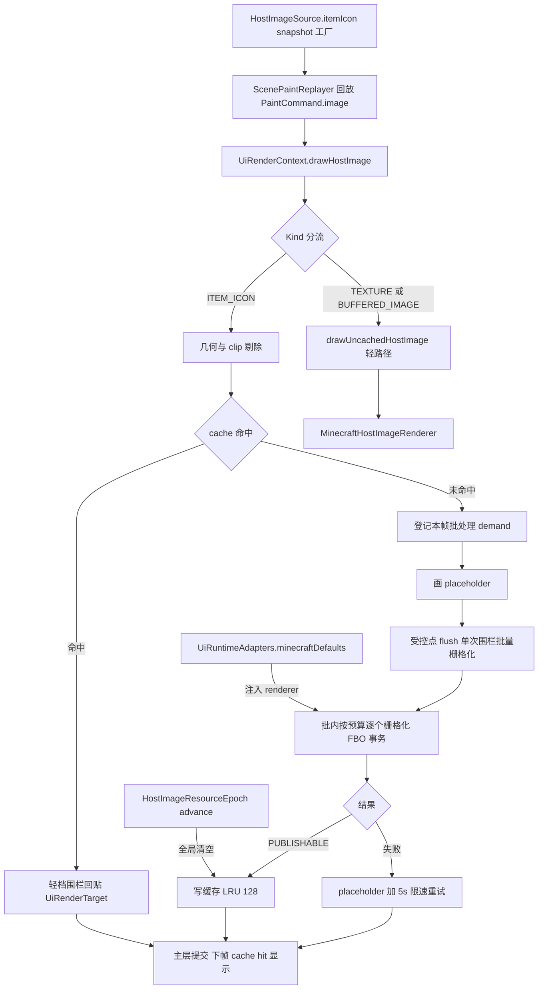
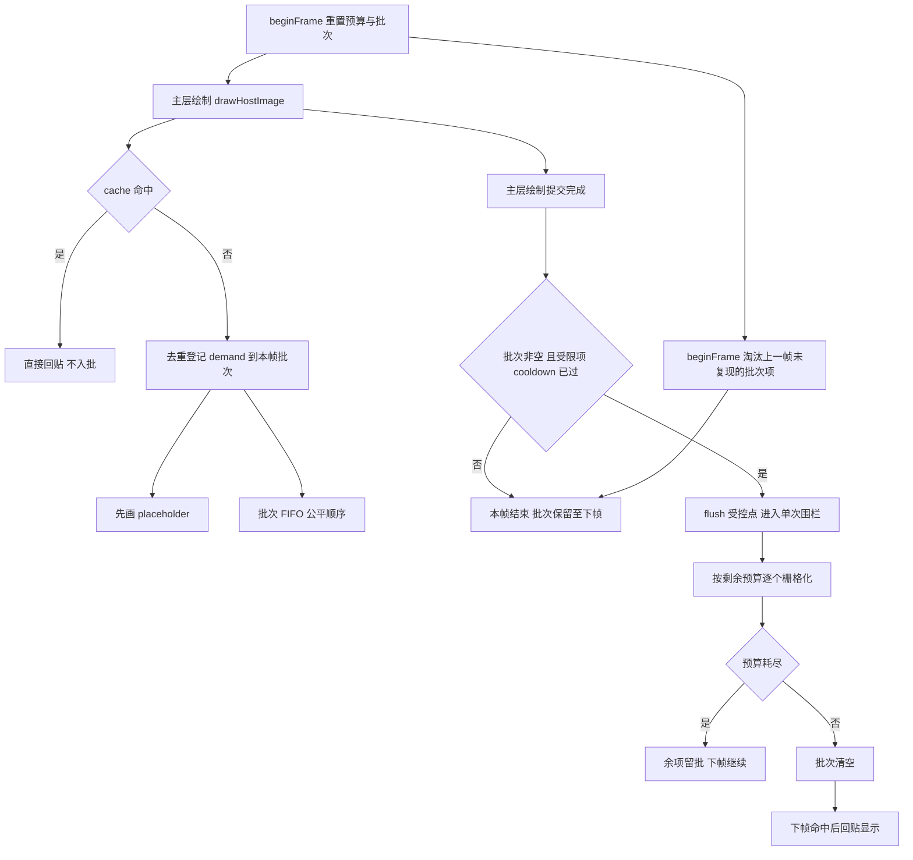
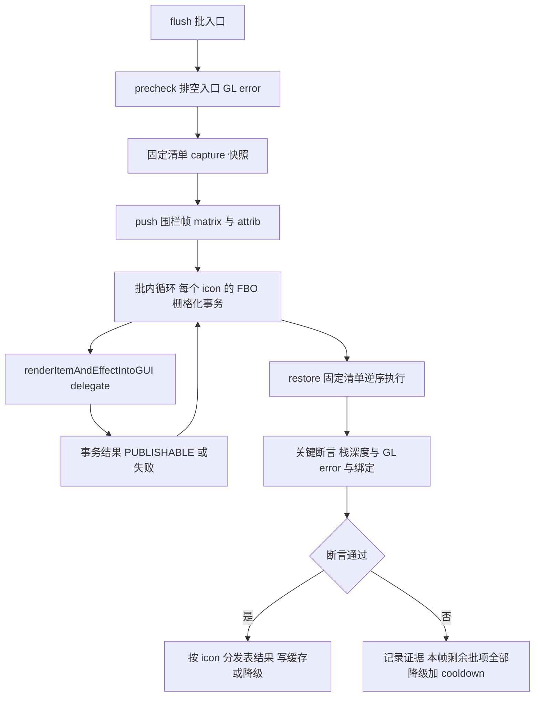
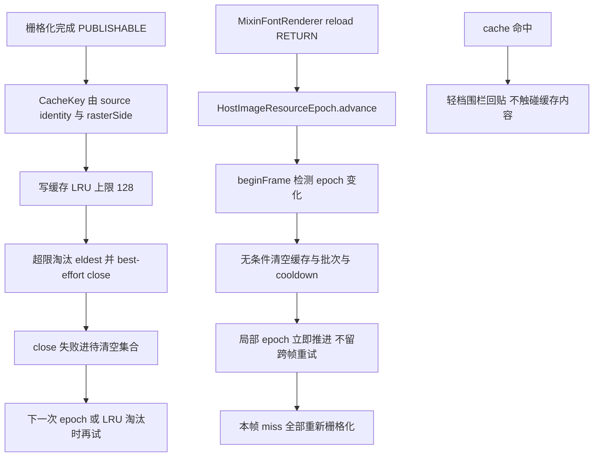
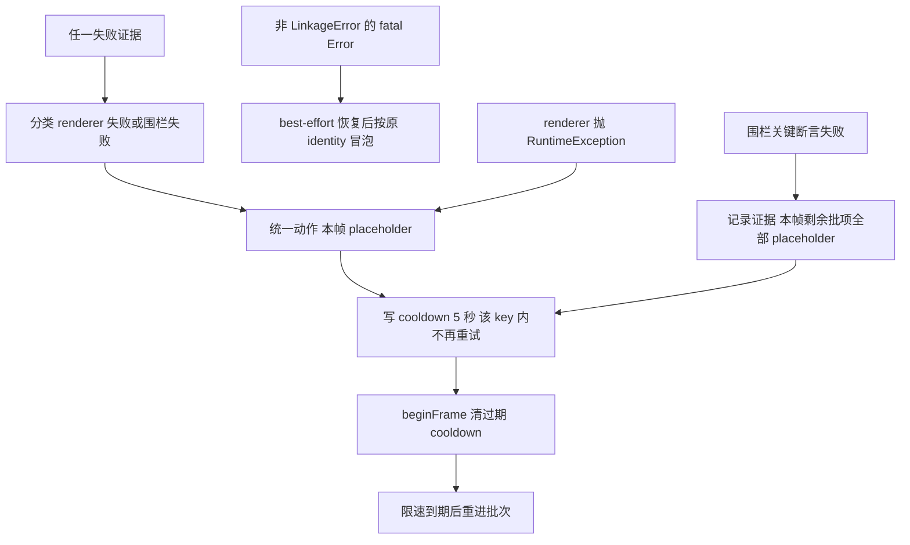

# 物品渲染简化方案大纲（草案）

> 状态：设计方向已确认（2026-08-13），待实施。仅设计大纲与分层细节，不含代码改动。
> 素材基线：`docs/开发者文档/架构图/08-物品渲染包装.md`（2026-08-13）、`docs/开发者文档/规格文档/物品视觉渲染接缝.md`、`AGENTS.md`、main 源码实时状态。

## 0. 简化目标

在硬约束不变的前提下降低复杂度：

- H1：任何栅格化/回贴完成后必须恢复宿主 GL 状态，绝不污染 MC 或其他 mod。
- H2：栅格化与纹理操作保持在渲染线程（宿主 draw 线程）执行。
- H3：公共 API `HostImageSource.itemIcon(ItemStack)` snapshot-only 语义不变；双栈已删除不回退。
- H4：失败不崩溃、可降级 placeholder、可限速重试；不引入新的跨线程等待。

## 1. 现状复杂度对照

| 现状机制 | 简化后处理方式 |
|---|---|
| 逐 icon miss 完整围栏：`UiRenderContext.java:708` 每个 miss 单独 `itemIconStateGuard.run`（capture 能力探测 + matrix×3/attrib×2/texture matrix/GL13-30 绑定/viewport/scissor/matrixMode 全量读取，restore 后 `findDrift` 全状态比对） | 每帧一次「批处理 pass」，单次围栏开合包住批内全部栅格化 |
| cache hit 窄围栏 `internal.image.HostImageCacheCompositeGuard` 独立实现（`UiRenderContext.java:682-685`） | 并入同一「固定清单围栏」组件的轻档 profile，共享 precheck/恢复/关键断言；不再独立维护第二套 capture/restore/drift |
| `HostImageGlStateGuard.java:372-417` capture 逐项能力探测（texture matrix、legacy client-active texture 子能力往返探测） | 一次性缓存 `GLContext.getCapabilities()` 能力位，取消逐项子能力探测 |
| `HostImageGlStateGuard.java:536-609` `findDrift` 全量比对（约 17 项） | 恢复后少数关键断言：modelview/projection/server-attrib/client-attrib 栈深度 + GL error 干净 + active texture 与 FBO binding 一致 |
| `HostImageGlStateGuard.java:348-366` 与 `HostImageCacheCompositeGuard.java:46-64` Tessellator idle 反射判定（双字段映射 fail-closed） | 取消反射；依赖批处理受控点 + 恢复断言 + renderer 异常统一转失败降级 |
| 失败三态 `UNAVAILABLE`/`HOST_STATE_LOST`/`ABORT_FRAME` + `UiRenderFrameAbortException` + `ui.screen.SceneFrameAbortBoundary`（`UiRenderContext.java:668-673`、`BaseScreen.java:44`、`McScreenBridge.java:166`） | 取消帧中止；全部失败并入「placeholder + 5s 限速重试」单一路径，`HOST_STATE_LOST` 仅作日志证据分级 |
| `HostImageRenderSession.java:79` `cleanupPending` 跨帧重试链 + `PaintContextCompositor.java:57-67` epoch 推进跳过逻辑 | raster close 失败只记录并进「待清空集合」，epoch advance 无条件清空并立即推进局部 epoch |
| raster close 失败 → `ABORT_FRAME`（`HostImageRenderSession.java:184-198`） | close 失败仅记录，不再阻塞渲染 |
| 预算双限制 `callsPerFrame=2` + `budgetNanos=2ms`（`HostImageRenderSession.java:19-20`） | 保留 `budgetNanos`（可选加批尺寸上限），删除 `callsPerFrame` 概念 |
| 公平队列 `pending`/`pendingSet`/`pendingLastSeenFrame` 三结构 | 保留语义：帧内 demand 去重 + FIFO 批次 + 帧间未复现项淘汰，结构可简化 |
| session LRU 上限 128 | 保留 |
| placeholder 降级 | 保留 |
| 非 `LinkageError` 的 fatal `Error` best-effort 恢复后按原 identity 冒泡 | 保留（H1 的恢复义务不变；原设计 fatal 亦穿透 `SceneFrameAbortBoundary`，行为一致） |
| `HostImageResourceEpoch` 全局失效（`MixinFontRenderer.java:28-35` 注入） | 保留，改为无条件清空 |
| `HostImageGlErrorTracker` checkpoint 链 | 保留（批级证据记录），不再用于三态分流 |
| `DocumentRemoteImageCache` 远程位图缓存 | 不在本方案范围（普通位图路径），保留现状 |

## 2. 简化后大纲（总流程图）

一条主线：frame 内 demand 收集 → 单次围栏批量栅格化 → 缓存写入/命中回贴 → 统一失败降级 → 提交。

## 3. 分层细节

### 3.1 栅格化调度层：帧内需求收集、预算/公平、批处理边界

要点：

- 需求登记与执行解耦：`drawHostImage`（`UiRenderContext.java:630`）在 miss 时只登记 demand 并画 placeholder，不再当帧触发 `rasterizeItem`（现 `UiRenderContext.java:665-673` 的 request 内联栅格化）。
- flush 受控点候选：`McScreenBridge` 主层 snapshot 提交之后（现 `paintContextCompositor.beginFrame()` 位于 `McScreenBridge.java:160`，flush 加在帧绘制末尾）；HUD 路径在 `UiHudRenderListener.renderHudFrame` 末尾。执行点为帧内 UILib 最后一段 GL 工作，围栏恢复后宿主帧内不再有 UILib 绘制。
- 批次跨帧保留：`beginFrame` 淘汰上一帧未再被请求的项（等价现 `HostImageRenderSession.java:100-114` 的 `pendingLastSeenFrame` 语义），保证批次有界。
- 预算：保留 `budgetNanos`（`HostImageRenderSession.java:20`），批内逐个栅格化直到预算耗尽；`callsPerFrame` 删除，由批尺寸上限（可选，默认 = 缓存上限）兜底。

### 3.2 围栏执行层：单次开合、固定捕获清单、关键断言、恢复

固定捕获清单（批级一次）：

- 能力位：一次性缓存 `GLContext.getCapabilities()` 的 OpenGL13/15/20/30 标志，取消逐项子能力探测。
- matrix：`GL_MATRIX_MODE`、modelview/projection 栈深度与矩阵；push 围栏帧（modelview、projection、texture matrix）。
- attrib：server/client attrib 栈深度；`glPushAttrib`/`glPushClientAttrib` 围栏帧。
- 绑定：active texture 与 texture0 binding、program、array/element buffer、vao、draw/read FBO、renderbuffer。
- viewport 与 scissor。

关键断言（批级一次，替代 `findDrift` 全量比对）：

- modelview/projection/server-attrib/client-attrib 栈深度 == 入口深度；
- GL error 排空干净；
- active texture 与 FBO binding == 入口值。

轻档 profile（cache hit 回贴）：同一围栏组件按 profile 参数化——只 push 固定 server attrib mask 与 client vertex array，捕获 texture binding/program/buffer binding，恢复后做同一组关键断言；不再有独立的 `HostImageCacheCompositeGuard` capture/restore/drift 三件套。

### 3.3 缓存与失效层：epoch 全局失效、LRU、写入时机

要点：

- `CacheKey`（`HostImageRenderSession.java:379-396`）与「缓存不读内容」承诺不变。
- epoch 无条件清空：删除 `PaintContextCompositor.java:57-67` 的「pending cleanup 时跳过且不推进局部 epoch」逻辑；close 失败不再阻塞，局部 epoch 立即推进。
- `cleanupPending` 逐帧重试链（`HostImageRenderSession.java:326-346`）删除；待清空集合只在 epoch/LRU 时机 best-effort 再试。
- 写入时机：批量栅格化 pass 内逐 icon 写缓存（PUBLISHABLE 且 raster 非空，`HostImageRenderSession.java:179-199` 语义保留）。

### 3.4 失败降级层：统一 placeholder + 限速重试，无帧中止

要点：

- 删除 `UiRenderFrameAbortException`、`SceneFrameAbortBoundary`、`RequestResult.Status.ABORT_FRAME`。
- `HostImageRenderOutcome.Status.HOST_STATE_LOST` 保留枚举值但降级为「证据分级」：行为与 `UNAVAILABLE` 相同（placeholder + cooldown），仅日志级别更高；已确认保留该枚举值仅作日志证据分级（见第 6 节）。
- cooldown 语义扩展：从「仅 UNAVAILABLE 写入」（`HostImageRenderSession.java:196-197`）扩展为「所有失败统一写入 5s」（`FAILURE_COOLDOWN_NANOS` 保留）。
- fatal `Error` 冒泡路径保留（`HostImageGlStateGuard.java:244-252`），best-effort 恢复后按原 identity 抛出；因帧中止边界删除，fatal 直接穿透到 Forge/MC 层，与原「穿透 boundary」行为一致。
- HUD 帧中止不对称问题（架构文档 P2-1）随 boundary 删除整体消失。

## 4. 关键决策与取舍

### 4.1 栅格化调度层

- 为什么简单：需求收集与执行解耦，围栏与绘制流解耦；批处理把围栏成本从「每 icon 一次」摊薄为「每帧一次」；公平队列语义不变但只服务于一个执行点。
- 放弃了什么：miss 当帧可见性——原方案 miss 且预算内当帧栅格化并立即回贴（`UiRenderContext.java:665-684`），新方案 miss 当帧只画 placeholder，下一帧（或限速到期后）才显示；`callsPerFrame` 细粒度。
- 残余风险：flush 受控点若未来被移动到宿主帧中段（主层绘制未结束），围栏恢复可能覆盖宿主后续绘制依赖的状态；需在实现时以注释/契约锁定 flush 位置。批次跨帧保留存在「图标已离开屏幕仍被栅格化」的浪费，由未复现项淘汰缓解。

### 4.2 围栏执行层

- 为什么简单：固定清单 + 对称 push/pop + 批级一次断言，取代「逐 icon 全量 capture/findDrift」；取消反射与子能力探测后 `StateAccess` 实现显著缩短，单测面也缩小。
- 放弃了什么：17 项全量 drift 验证；Tessellator idle 预检；legacy client-active texture 的 Core Profile 兼容探测（原 `HostImageGlStateGuard.java:755-774` 往返探测）。
- 残余风险：断言清单之外的宿主状态（fog、depth、cull、texture env 等）若被 `renderItemAndEffectIntoGUI` 污染将不被发现；按 1.7.10 `RenderItem` 实现评估，其触碰面主要落在 matrix/attrib/texture binding/viewport/scissor/FBO，已在清单内。取消 Tessellator 预检后，若宿主以非 idle 状态进入批 pass，`RenderItem` 内部会抛异常，表现为失败降级（placeholder + cooldown）而非现状的 fail-closed 全不可用。

### 4.3 缓存与失效层

- 为什么简单：只剩 LRU + epoch 无条件清空两条规则；close 失败从「帧中止级事件」降为「资源泄漏记录」。
- 放弃了什么：close 失败的严格跨帧重试保证；epoch 推进与 cleanup 的耦合保护。
- 残余风险：极端情况下 FBO 泄漏上界 = 缓存 128 + 待清空集合条目数；泄漏本身不违反 H1（不污染宿主状态），只占显存。

### 4.4 失败降级层

- 为什么简单：单一行为路径（placeholder + 5s 限速），无异常控制流、无帧边界组件、无三态机（架构文档「失败-重试状态机」图整体删除）。
- 放弃了什么：帧中止的强保护——原设计 `HOST_STATE_LOST` 即中止整帧（`HostImageRenderSession.java:191-195`），避免在疑似损坏的宿主状态下继续绘制；新方案信任「固定清单恢复 + 关键断言」足以满足 H1。
- 残余风险：若恢复/断言失败意味着宿主状态真实损坏，本帧后续 MC 渲染可能异常；但此时 UILib 已恢复到自己可验证的入口状态，剩余异常面交给 MC 自身错误处理与下帧观测。

## 5. 兼容影响

### 5.1 公共 API 不变项

- `HostImageSource.itemIcon(ItemStack)` snapshot-only 工厂语义不变（`HostImageSource.java:64-70`、`:138-140`）。
- scene core 只认 `SceneImageSource`、paint/replay 不触碰 GL 的平台无关边界不变。
- `HostImageRenderSession` 的缓存合同（identity key、LRU、不读内容）不变。
- 普通 texture/bitmap 轻路径与 `MinecraftHostImageRenderer` 合同不变。

### 5.2 行为变化项

- miss 当帧 placeholder、下一帧显示（原：当帧栅格化 + 当帧回贴）。
- 不再中止帧；`BaseScreen`/`McScreenBridge` 移除 `SceneFrameAbortBoundary` 调用，`UiRenderFrameAbortException` 删除。
- `RequestResult.Status.ABORT_FRAME` 删除、`callsPerFrame` 删除——`HostImageRenderSession` 为 public 类，属 breaking；落在已锁定的 5.0.0 breaking major 版本内（`物品视觉渲染接缝.md` 第 43-49 行）。
- cooldown 覆盖所有失败（原仅 UNAVAILABLE）。
- HUD 路径的帧中止不对称（P2-1）消失。

### 5.3 测试需要改写的范围

- `HostImageRenderSessionTest`：`ABORT_FRAME` 断言、cleanupPending 重试链用例删除；cooldown 与预算公平用例按批处理语义改写。
- `HostImageGlStateGuardTest`：FakeStateAccess 用例按固定清单重写；Tessellator 反射相关用例删除。
- `HostImageCacheCompositeGuardTest`：随轻档合并重写或并入新围栏组件测试。
- `UiRenderContextTest`：`resolveItemIconGeometry` 保留；新增批处理 demand/flush 语义用例。
- `SceneFrameAbortBoundaryTest`：随类删除。
- `SceneImagePipelineTest`：涉及 item icon 帧中止路径的用例改写。
- `UiHudRenderListenerGlFenceTest`：改写为验证 HUD flush 点与围栏交互。
- `McScreenBridgeTest`、`UiScreenHostSessionTest`、`PaintContextCompositorTest`：frame 边界调用点与 epoch 清空语义改写。
- 预期不变：`HostImageSourceTest`、`MinecraftItemIconRendererTest`、`MinecraftHostImageRendererTest`。

## 6. 已决策记录（2026-08-13）

1. **miss 当帧可见性**：已确认接受「miss 当帧 placeholder、下一帧显示」的一帧闪烁，换取单次围栏批处理。备选「两遍回放」与「保留逐 icon 惰性围栏」不再考虑。
2. **帧中止机制**：已确认放弃帧中止——`SceneFrameAbortBoundary` / `UiRenderFrameAbortException` 删除，围栏关键断言失败仅降级 placeholder + 5s 限速重试。H1 的保证即为「固定清单恢复 + 关键断言 + 降级」。
3. **public breaking 范围**：已确认删除 `HostImageRenderSession.RequestResult.Status.ABORT_FRAME` 枚举与 `UiRenderFrameAbortException`，`HostImageRenderOutcome.Status.HOST_STATE_LOST` 保留枚举值仅作日志证据分级；全部落在 5.0.0 breaking major 内。
